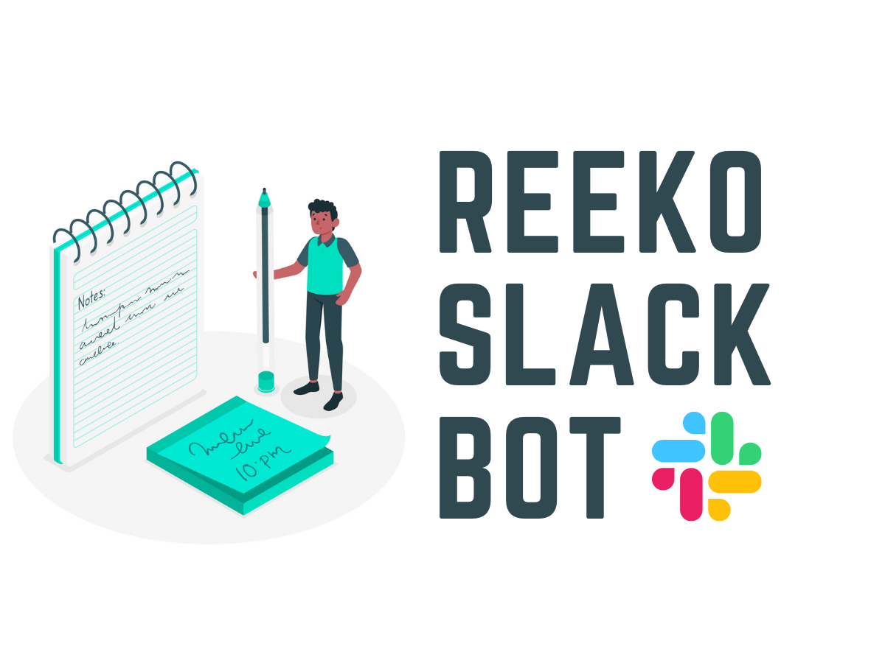

 
 
 

  
  <h1 align="center">Reeko</h1>
  <h4 align="center"></h4>
  

 
 

### Document Summarisation

### File Syncing and Data Backup inside Slack

S3 Slack Bot enables users to access files in your S3 bucket directly from Slack using _Slash commands_. By using simple commands like `/s3-get filename` and `/s3-delete filename` we can find or delete files. Whenever a new file is shared on any public channel it is automatically added to the S3 test bucket, ensuring that all your slack files are safe in case a teammate accidently deletes a file that you need.

### File Searching

Most of the time we don't know the exact name of the file we are looking for. We also need to check if the file is actually present in the S3 bucket. Pooling the bucket over and over again to find a file or check for its existence is a computationally expensive and slow operation. To enable faster indexing of all the files on the S3 bucket, there is a layer of RediSearch between the Slack Bot and the S3 bucket. A user can find any file using the `/s3-search` command which opens a file search dialog. RediSearch's autocomplete functionality helps in navigating or guiding the user by prompting them with likely completions and alternatives to the filenames as they are typing it.

### Architecture Diagram

  

## How we built it

The Project is set up to work in a python3 virtual environment. The Slack app is built using <a href="https://slack.dev/bolt-python/concepts">Bolt for Python</a> framework. For connecting to the AWS S3 bucket, AWS Comprehend and AWS Textract we use their respective boto3 clients. We connect to RedisSearch using the <a href="https://RedisSearch-py.readthedocs.io/en/v7.12.0/"> Python RedisSearch Client</a>.

The Slack app listens to all sorts of events happening around your workspace — messages being posted, files being shared, users joining the team, and more. To listen for events, the slack app uses the Events API. To enable custom interactivity like the search modal we use the Blocks Kit.

Slash commands perform a very simple task: they take whatever text you enter after the command itself (along with some other predefined values), send it to a URL, then accept whatever the script returns and posts it as a Slackbot message to the person who issued the command or in a public channel. Here are the 5 slash commands we use to interact with the Cortx S3 bucket.

### File Sync

Whenever a new file is shared in any public slack channel the <a href="https://api.slack.com/events/file_shared#:~:text=The%20file_shared%20event%20is%20sent,the%20files.info%20API%20method."> <em>file_share event</em></a> is sent to the Slack app. The file is first indexed into RedisSearch and then added to the Cortx S3 bucket with a key as file name.

 
<a href='https://www.freepik.com/vectors/illustrations'>Illustrations vector created by stories - www.freepik.com</a>
