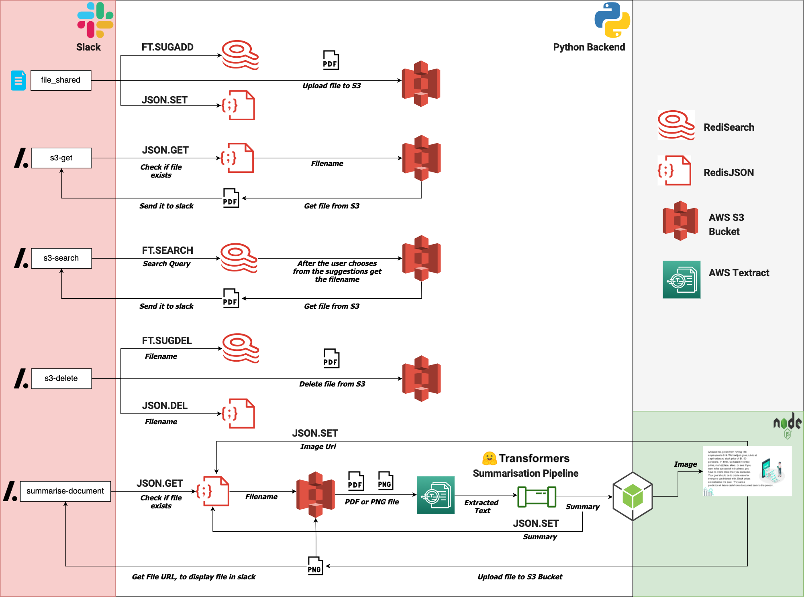

[](https://forthebadge.com)
[](https://forthebadge.com)
[](https://forthebadge.com)
[](https://forthebadge.com)
[](https://forthebadge.com)
[](https://forthebadge.com)
[](https://forthebadge.com)
[](https://forthebadge.com)


# Reeko Slack Bot

Video Link: [https://youtu.be/sNNbtyWloRo](https://youtu.be/sNNbtyWloRo)
<br/>

With 10+ million daily active users and millions of file shared everyday Slack is where collaboration happens. Using Reeko you can find files, download them or delete them permanently from S3 bucket without leaving Slack or writing a single line of code. Everyday so many files are shared on Slack and we may loose track of the file we need. Using advanced Natural Language Processing (NLP) and Natural Language Understanding (NLU) techniques, Reeko extracts all the text from the long and boring documents outputs the summary as an image. This way you don't even have to open the document to know what is inside of it!. Most of the time we don't know the exact name of the file we are looking for in and we need autocomplete to figure out the exact file name for us, Reeko has a file search engine built right into Slack that helps you find any file on your S3 bucket.


## Features

### Document Summarisation

Document Summarization is the task of rewriting a document into its shorter form while still retaining its important content. With the help of the `/summarise-document filename` you can summarise any document. Everything from minutes of the meeting to UNICEF can be shortened.

### File Syncing and Data Backup inside Slack

Reeko Slack Bot enables users to access files in your S3 bucket directly from Slack using _Slash commands_. By using simple commands like `/s3-get filename` and `/s3-delete filename` we can find or delete files. Whenever a new file is shared on any public channel it is automatically added to the S3 test bucket, ensuring that all your slack files are safe in case a teammate accidently deletes a file that you need.

### File Searching

Most of the time we don't know the exact name of the file we are looking for. We also need to check if the file is actually present in the S3 bucket. Pooling the bucket over and over again to find a file or check for its existence is a computationally expensive and slow operation. To enable faster indexing of all the files on the S3 bucket, there is a layer of RediSearch between the Slack Bot and the S3 bucket. A user can find any file using the `/s3-search` command which opens a file search dialog. RediSearch's autocomplete functionality helps in navigating or guiding the user by prompting them with likely completions and alternatives to the filenames as they are typing in.

## Tech Stack

- [Slack Block Kit](https://api.slack.com/block-kit): A UI framework for Slack apps that offers a balance of control and flexibility when building experiences.
- [Python](https://www.python.org/): The [redisjson-py](https://github.com/RedisJSON/redisjson-py) and [redisearch-py](https://github.com/RediSearch/redisearch-py) libraries are used to connect to [**Redis**](https://redis.io) and [Slack Bolt For Python](https://slack.dev/bolt-python/concepts) is a foundational framework that makes it easier to build Slack apps is used to build the chat bot.
- [Nodejs](https://nodejs.org/en/): Responsible for Image Generation

## Architecture Diagram



## How is it built

The Project is set up to work in a python3 virtual environment. The Slack app is built using [Bolt for Python](https://slack.dev/bolt-python/concepts) framework. For connecting to the AWS S3 bucket, AWS Comprehend and AWS Textract we use their respective boto3 clients. We connect to RedisSearch using the [Python RedisSearch Client](https://RedisSearch-py.readthedocs.io/en/v7.12.0/).

The Slack app listens to all sorts of events happening around your workspace — messages being posted, files being shared, users joining the team, and more. To listen for events, the slack app uses the Events API. To enable custom interactivity like the search modal we use the Blocks Kit.

Slash commands perform a very simple task: they take whatever text you enter after the command itself (along with some other predefined values), send it to a URL, then accept whatever the script returns and posts it as a Slackbot message to the person who issued the command or in a public channel. Here are the 5 slash commands we use to interact with the Cortx S3 bucket.

## Redis Usage

We have used 2 Redis Modules.

- [RedisJSON](https://oss.redislabs.com/redisjson/) - For storing file information like filename, summary and image url.
- [RediSearch](https://oss.redislabs.com/redisearch/) - For searching files in the S3 bucket

Initialising RediSearch in redisearch_connector.py. Creating an index with the name `file_index`.

```py
from redisearch import Client, TextField, AutoCompleter, Suggestion

class RedisSearchConnector():
    def __init__(self):
        self.index_name = 'file_index'
        self.client = Client(self.index_name)
        self.ac = AutoCompleter(self.index_name)
```

Initialisiing RedisJSON in redisjson_connector.py

```py
from rejson import Client, Path

class RedisJsonConnector():
    def __init__(self):
        self.rj = Client(decode_responses=True)

```

### File shared on Slack

Whenever a new file is shared in any public slack channel the[**file_share event**](https://api.slack.com/events/file_shared#:~:text=The%20file_shared%20event%20is%20sent,the%20files.info%20API%20method.) is sent to the Slack Bolt app. Firstly the file name is added as suggestion using the `FT.SUGADD` command in RediSearch, the file data like name, created, timestamp, mimetype, filetype, size, summary and image file path are added using the `JSON.SET` command.
The file is then stored on the S3 bucket as an object with the key as the filename.

```json
file_data = {
  "file_id": "F021THCTFJ7",
  "file_name": "amazonpdf",
  "created": 1620902755,
  "timestamp": 1620902755,
  "mimetype": "application/pdf",
  "filetype": "pdf",
  "user_id": "U01U4DV4C8J",
  "size": 345142,
  "summary": "",
  "image_file_path": ""
}
```

### /s3-get

After fetching the filename from the **command['text']** parameter we check if a the file exists using the `check_if_document_exists` function in `redisearch_connector.py` file. If the document doesn't exist it returns false and nothing is done. If the file if found, using the `JSON.GET` command we get the file's name and then download the file from S3. The downloaded file is sent back as a direct message in Slack.

### /s3-search

This command opens up a modal inside of Slack with a search bar, the user is suggested the file names depending on whatever text is written in. For example if the bucket has documents like abc.csv, abcd.csv, abcdef.csv upon typing `abc` we get will get these 3 results as a list from the `FT.SEARCH` command. After the user chooses one of the file from the suggestion the file is downloaded and sent back to slack.

### /s3-delete

This command permanently deletes a file from the S3 bucket. All you have to do is get the filename from **command['text']** parameter. The file data is deleted from RedisJson using the `JSON.DEL` command and it is removed from RediSearch's suggestions using the `FT.SUGDEL` command. Users are informed once the file is successfully deleted

### /summarise-document

Using the summarise document command large documents can be converted into images

1. Get the file name from the **command['text']** parameter.
2. If the file if found, using the `JSON.GET` command we get the file's name.
3. Download the pdf or png file locally from S3 bucket
4. Extract the text using AWS Textract.
5. The extracted text is summarised using Hugging face transformers summarisation pipeline. The text summary is also added to the JSON document for the file using `JSON.SET` command.
6. A post request is then sent to the /create-image on the nodejs backend.
7. The image that is returned is saved to the S3 bucket and sent back to Slack.
8. The image URL is also added to the JSON document using `JSON.SET` command.

Here are a few examples of the images with document summary for the [Amazon 2020 share holder letter](https://s2.q4cdn.com/299287126/files/doc_financials/2021/ar/Amazon-2020-Shareholder-Letter-and-1997-Shareholder-Letter.pdf)


## Basic Installation Instructions

[Illustrations vector created by stories - www.freepik.com](https://www.freepik.com/vectors/illustrations)
