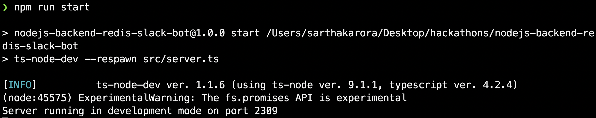

# Nodejs Installation Instructions

### Requirements

- [GraphicsMagick](#GraphicsMagick)
- [Nodejs](#Nodejs)

### Getting Started


---

### GraphicsMagick

GraphicsMagick is the swiss army knife of image processing. You need to have GraphicsMagick installed on your machine to generate images.

You can find the suitable release from [http://www.graphicsmagick.org/download.html#download-sites](http://www.graphicsmagick.org/download.html#download-sites)


---

### Nodejs

> Note Please follow all the steps in [python-backend/README.md](../python-backend/README.md) first.

Copy the AWS credentials from the [python-backend/.env](../python-backend/README.md) to the [config.json](./src/config/config.json) file.

```json
{
  "accessKeyId": "",
  "secretAccessKey": "",
  "region": ""
}
```

Install all the packages and run the server

```
npm install
npm run start
```



By Source, Fair use, https://en.wikipedia.org/w/index.php?curid=4426442
